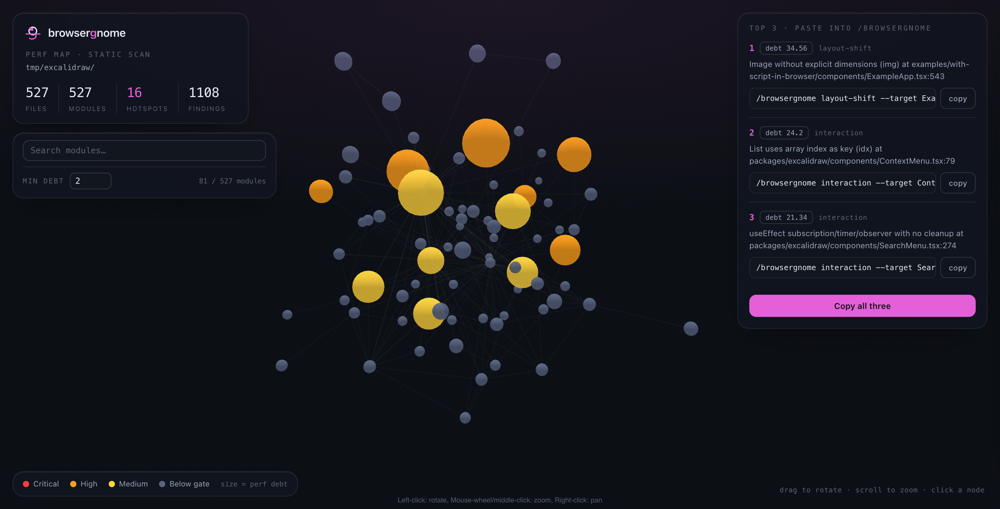
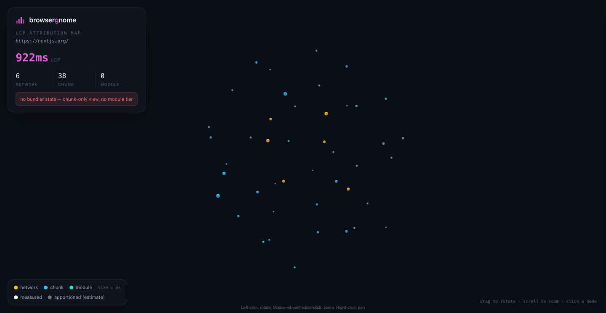
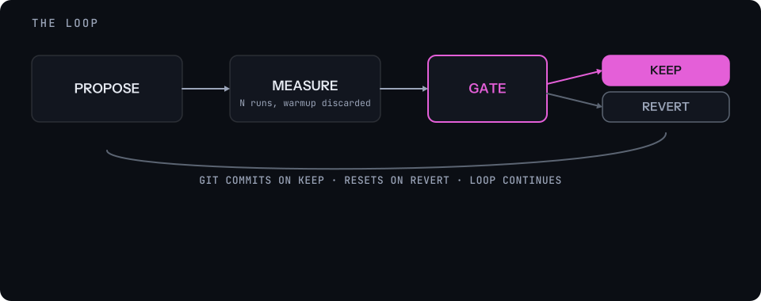
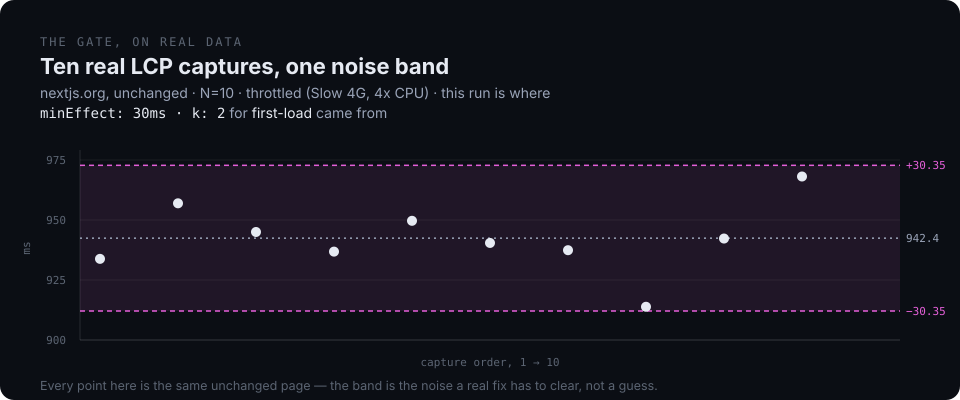
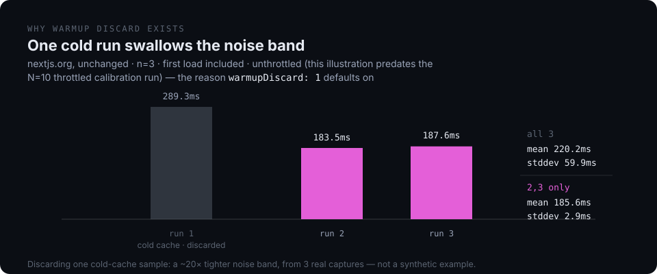

<picture>
  <source media="(prefers-color-scheme: dark)" srcset="docs/banner-dark.png">
  
</picture>

[](https://github.com/xavi-999/browsergnome/actions/workflows/ci.yml)
[](LICENSE)
[](https://github.com/xavi-999/browsergnome/stargazers)
[](https://github.com/xavi-999/browsergnome/network/members)
[](https://github.com/xavi-999/browsergnome/issues)
[](https://xavi-999.github.io/browsergnome/)
[](package.json)
<!-- npm version / downloads: uncomment once published — not on npm yet, see Install.
[](https://www.npmjs.com/package/browsergnome)
[](https://www.npmjs.com/package/browsergnome)
-->
<!-- Release: uncomment once a v0.1.0 tag + GitHub release exist.
[](https://github.com/xavi-999/browsergnome/releases)
-->

> **The autonomous JS web performance engineer.** `/browsergnome`: one command turns scattered
> web performance tooling into a single, scientific loop — **propose → measure → keep/revert** — that
> ships only the gains it can prove.

Inspired by Andrej Karpathy's `/autoresearch`. Fully adapted to the web.

---

## What it solves

Web performance tooling is powerful but scattered — a Lighthouse run, a trace capture, a bundle
analyzer, a hunch about which fix will help — and nothing shares context between sessions or gates a
guess against a measurement. browsergnome routes each check to the right layer and runs a loop with a
real gate: one fix at a time, measured N times, kept only if the gain is clearly bigger than the
run-to-run wobble — otherwise reverted automatically, git as the memory that makes the revert exact.

The two maps, both real:

<table>
<tr>
<td width="50%">

**Perf Map 3D** — a static AST scan of a real repo (excalidraw, 527 modules), rendered as an
interactive 3D graph. Node size = perf debt, color = severity. 16 hotspots surfaced out of 527 modules
— signal, not noise.

</td>
<td width="50%">

**LCP Attribution Map** — a real captured trace (nextjs.org, 922ms LCP), broken into network and
chunk nodes. Solid = measured directly from the trace; translucent = apportioned estimate.

</td>
</tr>
<tr>
<td width="50%"></td>
<td width="50%"></td>
</tr>
</table>

▶ [**Explore both live**](https://xavi-999.github.io/browsergnome/) — same real scan, same real
capture, plus the live run report.

## Install

```
/plugin marketplace add xavi-999/browsergnome      # or a local path to this repo
/plugin install browsergnome
```

**Prerequisites:** Node ≥ 18 · `chrome-devtools-mcp` · clean git tree.

**Scripts need `npm install`:** The SessionStart hook does this automatically inside a Claude session. For by-hand or CI use, run `npm install` in the plugin directory first.

Then, from inside a Claude Code session with the plugin loaded, run `/browsergnome` in any web repo.

<details>
<summary>Or clone it directly (not published to npm yet, so no <code>npx browsergnome@latest</code> fallback)</summary>

```bash
git clone https://github.com/xavi-999/browsergnome.git
cd browsergnome
npm install
```

</details>

## Quickstart

### Map your app (no browser needed)

→ See a real example first: [Perf Map 3D](https://xavi-999.github.io/browsergnome/perf-map.html) ·
[LCP Attribution Map](https://xavi-999.github.io/browsergnome/lcp-map.html)

```
/browsergnome scan <path-to-a-web-repo>
```

An AST scan surfaces real structural hotspots — severity-weighted, diminishing-returns-capped,
centrality-amplified — so the loop starts from a hypothesis instead of a blind guess. Opens
`perf-map.html` when done.

<details>
<summary>Prefer the raw scripts? (offline, outside a Claude session)</summary>

```bash
BG="${CLAUDE_PLUGIN_ROOT:-.}"   # falls back to repo-root-relative if you cloned the repo directly
node "$BG/skills/browsergnome/scripts/perf_scan.mjs" <path-to-a-web-repo> --out graph.json
node "$BG/skills/browsergnome/scripts/build_perf_map.mjs" graph.json --out perf-map.html --open
```

</details>

### Run the loop

> *Point it at a slow page. It measures, proposes, measures again, and only keeps what it can prove.*

```
/browsergnome                                    # opens the menu
/browsergnome the homepage is slow to load        # → first-load preset
/browsergnome my JS bundle is too big             # → bundle-size preset
/browsergnome the UI feels laggy when I click X   # → interaction preset
/browsergnome content keeps jumping               # → layout-shift preset
```

A natural-language perf complaint routes straight to the matching preset — no need to memorize
flags. Each iteration is one atomic change, measured against a noise-characterized gate, committed
on KEEP or reverted on REVERT — no human babysitting the loop between iterations.

## Modes & presets

| Menu item | What it does |
|---|---|
| Perf Map 3D | Static AST scan → interactive 3D graph → Top-3 candidate fixes |
| Autoresearch | Pick a preset, run the propose → measure → keep/revert loop |
| Doctor | Verifies the chrome-devtools-mcp pin, detects framework/bundler/host, bootstraps `.bgn/` |
| Configurations | View/edit `.bgn/config.json` |
| Senior Engineer Audit | Architectural-debt scan — RSC boundaries, provider nesting, waterfall fetching, layout bloat |

| Preset | Metric | Gate | Notes |
|---|---|---|---|
| `first-load` | LCP | `minEffect: 30ms` · `k: 2` | N-run + warmup discard; calibrated from a real N=10 run |
| `bundle-size` | bundle bytes | `minEffect: 1024B` | Build-time only, no browser — deterministic builds, no run-to-run noise to characterize |
| `interaction` | INP | `minEffect: 10ms` · `k: 2` | Driven by a real trusted click, not a synthetic event |
| `layout-shift` | CLS | zero-inflation gate | Compares shift-occurrence rate rather than a continuous noise band |

`/what-if` (a separate command) answers "is this worth doing at all?" — the same
measure→apply→re-measure→gate loop, but always reverts and writes a decision memo instead of a commit.

**Dep Pulse** runs alongside Autoresearch and Senior Engineer Audit: a read-only subagent resolves the
app's perf-critical dependencies against the registry, reads the real release notes, and surfaces
genuinely perf-relevant bumps — majors included — as a table of what each brings and what it could
break. Nothing installs without the user picking it from that table first; anything green-lit goes
through the same measure→gate loop as every other fix.

## How it works

**The loop.** Propose one atomic change → measure it N times → gate it against the noise band → keep
(commit) or revert (restore from snapshot). Git is the memory that makes auto-revert possible — nothing
is deleted, every candidate is a snapshot away from its prior state.



**The gate, on real data.** A fix has to clear both an absolute floor and the measurement noise, not
just look better on one run. Ten real LCP captures against an unchanged nextjs.org — the noise band
here is where `first-load`'s `minEffect: 30ms` / `k: 2` came from.



**Warmup discard.** Three real captures against the same unchanged page — one cold-cache run inflates
stddev 59.9ms → 2.9ms once discarded, a ~20× tighter noise band from dropping a single sample. That's
why `warmupDiscard` defaults on.



## CI Autopilot

Two workflow templates in `templates/ci/` for running Autoresearch unattended in a target web repo:

- **`browsergnome-autopilot-build.yml`** — build-only, no browser or Chrome. Measures `bundle-size`;
  detects browser-only findings but defers them to the PR body rather than applying an unmeasured fix.
- **`browsergnome-autopilot-browser.yml`** — runs headless Chrome on plain `ubuntu-latest`. Measures
  all three browser-driven presets.

Both are weekly-cron GitHub Actions that open a PR with the gated result. See `templates/ci/README.md`
for the full adoption guide, including the required runner-noise recharacterization step before
trusting the gate on CI hardware.

## Requirements

- **Node ≥ 18, ESM throughout.**
- **Measurement is delegated** to [`chrome-devtools-mcp`](https://github.com/ChromeDevTools/chrome-devtools-mcp)
  (pinned in `.mcp.json`) — never called via `@latest`.
- **Clean git tree required** — git is the experiment log; auto-revert needs a clean baseline before
  a run starts.
- The LCP Attribution Map needs a captured performance trace (`performance_start_trace` /
  `performance_stop_trace` via chrome-devtools-mcp, or any Chrome DevTools Protocol trace JSON).
- `bundle_stats.mjs` supports webpack and esbuild stats output; Vite/Turbopack are not implemented yet.

## Repo layout

```
.claude-plugin/      plugin.json + marketplace.json — self-installable via /plugin
.mcp.json            bundles chrome-devtools-mcp (pinned version) as an MCP server
commands/            /browsergnome and /what-if slash-command entrypoints
hooks/               SessionStart (npm install) + perf-memory nudge
skills/browsergnome/
  SKILL.md            the orchestrator — menu, presets, loop, gate, config, memory
  references/         tools.md, presets.md, measurement.md, perf-map.md, knowledge base,
                       senior-audit.md, architectural-perf-catalog.md, what-if.md,
                       three-axis stack catalogs (frameworks/ bundlers/ hosts/)
  scripts/            perf_scan.mjs, build_perf_map.mjs, lcp_attribution.mjs, build_lcp_map.mjs,
                       bundle_stats.mjs, trace_metrics.mjs, stats.mjs, doctor.mjs, build_playbook.mjs,
                       build_run_report.mjs
  assets/             vendored 3d-force-graph, HTML templates, real trace/bundle-stats fixtures,
                       seeded playbook priors
templates/ci/         CI Autopilot workflow templates (build-only + browser)
docs/                 banner, logo, diagrams, perf-map.png / lcp-map.png screenshots
```

Bootstrapped into any target repo by Doctor: `.bgn/perf-memory.md`, `config.json`, `ledger/`,
`archive/`, `audit/`, `what-if/`.

## Related

Uses the same measure-before-you-change discipline as
[metrognome](https://github.com/uphold/metrognome), its React Native counterpart.

## Contributing

See [CONTRIBUTING.md](CONTRIBUTING.md) for setup, tests, and code style, and
[CODE_OF_CONDUCT.md](CODE_OF_CONDUCT.md) for community standards. Agent-facing instructions live in
[AGENTS.md](AGENTS.md) (or [CLAUDE.md](CLAUDE.md) for Claude Code specifically).

## License

[MIT](LICENSE)
